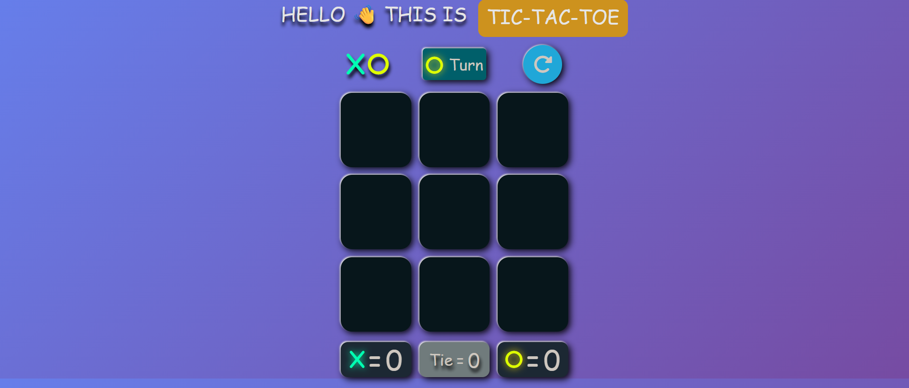

# 🎮 Tic Tac Toe Game

A simple and fun Tic Tac Toe game built with HTML, CSS, and JavaScript. It features interactive gameplay, score tracking, and round management with a polished user interface.

---

## 🔗 Live Demo

👉 [https://tic-tac-toe-partha.netlify.app//](https://tic-tac-toe-partha.netlify.app//)

---

## 📸 Screenshots

| Screenshots                      |
| -------------------------------- |
|  |

---

## 🚀 Features

- 🎲 Two-player mode (X vs O)
- 🔄 "Next Round" and "Reset" functionality
- 🧠 Automatic win/draw detection
- 🏆 Scoreboard tracking wins for each player and draws
- 🎨 Dynamic turn indicator and stylish UI using Font Awesome icons
- 🟩 Winner highlight and color-coded player status

---

## 🧰 Tech Stack

- HTML5
- CSS3
- JavaScript (ES6)
- Font Awesome for icons

---

## 🎮 How to Play

The game is played on a 3x3 grid.
Player O goes first.
Players alternate turns by clicking on empty boxes.
The first player to get 3 of their marks in a row (vertically, horizontally, or diagonally) wins the round.
If all 9 boxes are filled and no one wins, the round is declared a draw.
Use "Next Round" to play again or "Reset" to restart scores.

---

## 🧪 Getting Started

### 📦 Installation

Clone the repo :

```bash
git clone https://github.com/PARTHA-PATTANAYAK-02/Tic_Tac_Toe.git
```

---

## 🌐 Deployment

## This project can be deployed easily using:

- ### 🔗 [netlify](https://tic-tac-toe-partha.netlify.app/)

## ✍️ Author

**Made with ❤️ by [Partha Pattanayak](https://github.com/PARTHA-PATTANAYAK-02)**
